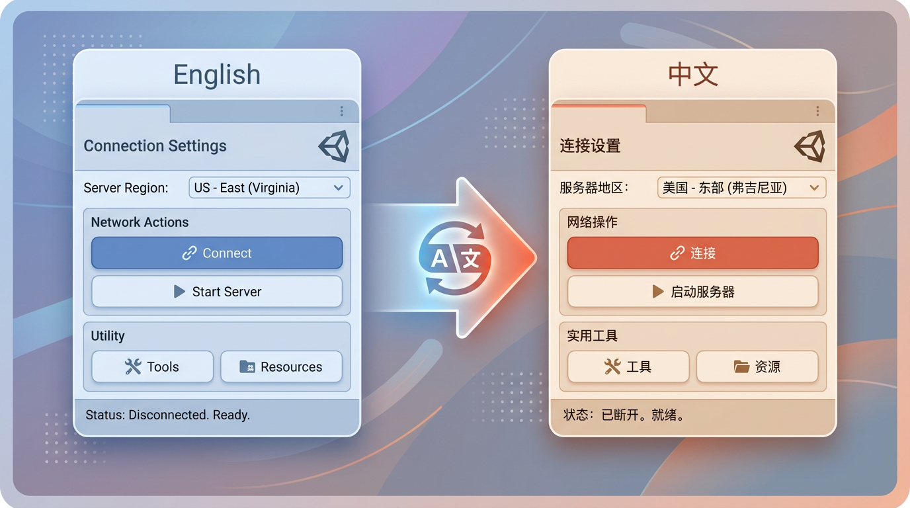

# MCP for Unity 中文补丁

[](LICENSE)
[](https://unity.com/)
[](https://github.com/CoplayDev/unity-mcp)

给 [CoplayDev/unity-mcp](https://github.com/CoplayDev/unity-mcp) 编辑器窗口做的**源码级**中文汉化补丁——不是运行时翻译插件，而是直接把中文"烧"进包解析后的 `.uxml` / `.cs` 源文件里。

## 为什么不用运行时翻译

最初的方案是用 `EditorApplication.update` 周期性扫描窗口的 `rootVisualElement`，跑一个字典把英文文本替换成中文。这个思路在 MCP for Unity 窗口上直接翻车：包自身也有一个每 2 秒刷新一次的状态轮询（`OnEditorUpdate`），会把刚被翻译过的文字重新写回英文——两套轮询打架，连接状态文字中英文来回闪烁，缩短轮询间隔只能缓解、治不了根。

这个补丁换了个思路：**直接改源文件**。补丁在 Editor 加载时定位到 `com.coplaydev.unity-mcp` 包解析后的物理路径，对 `Editor/Windows` 子树下的 UI 源文件做一次性文本替换，编译产物本身就是中文——没有轮询、自然没有竞态。

## 效果预览



## 特性

- ✅ **幂等**：重复应用不会出错、不会重复替换。
- ✅ **自愈**：`Library` 被清理、项目重新 clone、包因跟踪 `#main` 被 resolve 到新 commit 后，下次 Editor 加载会自动重新打上补丁。
- ✅ **版本安全**：只有包版本号命中已验证过的版本才会应用替换；版本不匹配会打印警告并整体跳过，绝不做"部分替换"这种半吊子操作，原文保留英文。
- ✅ **可回滚**：一键还原成英文原版，首次修改前的原始文件都有备份。

## 安装使用

### 前置条件

- 项目已经装好 [`com.coplaydev.unity-mcp`](https://github.com/CoplayDev/unity-mcp)，且版本号在下方「已验证版本」范围内。

### 安装步骤

1. 把本仓库的 `McpForUnityChinese/` 文件夹整个复制到你项目的任意 `Editor` 目录下，例如：

   ```
   Assets/Editor/McpForUnityChinese/
   ```

   不需要带 `.meta` 文件——Unity 会在导入时自动为这些新文件生成属于你项目的 GUID。

2. 回到 Unity，等待脚本编译完成。补丁基于 `[InitializeOnLoad]`，编译完成后会自动检测包版本并应用替换，无需任何手动操作。

3. 打开 `Window → MCP for Unity`，界面文本应已是中文。

### 手动触发 / 还原

补丁同时提供两个菜单项，方便强制重跑或回滚验证：

| 菜单路径 | 作用 |
|-|-|
| `Tools → 汉化 → 立即应用 MCP for Unity 中文补丁` | 忽略幂等标记，强制重新执行一次替换（扩充翻译字典后手动验证用，不用等下次重启 Editor） |
| `Tools → 汉化 → 还原 MCP for Unity 英文原版` | 用备份文件覆盖当前文件，还原成英文原版 |

## 已验证支持版本

| unity-mcp 版本 | 状态 |
|-|-|
| `10.0.0` | ✅ 已验证 |

上游发布新版本后，界面文本可能有变动，直接套用旧字典可能会漏译新增的文案。如果你在新版本上使用，欢迎：

1. 对比新旧版本 `Editor/Windows` 下的文本差异；
2. 在 `McpForUnityPatchData.cs` 里补充新增的 `TextMap` / `InterpolatedTemplates` 条目；
3. 把验证过的新版本号加进 `McpForUnityPatchData.SupportedVersions`；
4. 提一个 PR 回来，帮到其他人。

## 工作原理

补丁引擎（`McpForUnitySourcePatcher.cs`）只做几件事：

1. 用 `PackageInfo.GetAllRegisteredPackages()` 定位 `com.coplaydev.unity-mcp` 包解析后的物理路径（`resolvedPath`）和当前版本号。
2. 版本号必须命中 `SupportedVersions`，否则打印警告后直接返回，不碰任何文件。
3. 检查幂等标记文件 `.mcp-zh-patched`，已经是当前版本就跳过。
4. 递归遍历 `Editor/Windows` 下所有 `*.uxml` / `*.cs`：
   - UXML 只替换 `text="..."` / `tooltip="..."` 属性值；
   - C# 只替换含 `.text` / `.tooltip` 赋值那一行的字符串字面量（含跨行 `switch` 表达式的情况）；
   - 对含插值表达式的动态文本（如 `Session Active ({instanceName})`）用专门的正则模板，保留 `{...}` 表达式本身不动，只翻译周围的字面文字。
5. 首次修改任意文件前，会把原始内容备份到 `.mcp-zh-backup/`，供还原使用。
6. 有文件发生变化就写入/更新幂等标记，并触发 `AssetDatabase.Refresh()`。

全程只依赖 `UnityEditor` / `UnityEditor.PackageManager` / `System.IO` / `System.Text.RegularExpressions`，不引用任何项目专属类型，所以整个 `McpForUnityChinese/` 文件夹可以直接复制到任意项目里独立工作。

## 贡献

欢迎提交 Issue / PR：

- 上游发新版本后补充翻译映射；
- 发现某条译文不准确或有更好的措辞；
- 发现某个界面文本没有被覆盖到。

## 鸣谢

翻译对象是 [CoplayDev/unity-mcp](https://github.com/CoplayDev/unity-mcp) —— 一个很好用的 Unity MCP Server/Editor 集成项目，本补丁只做本地化，不修改其任何功能逻辑。

## License

[MIT](LICENSE)
